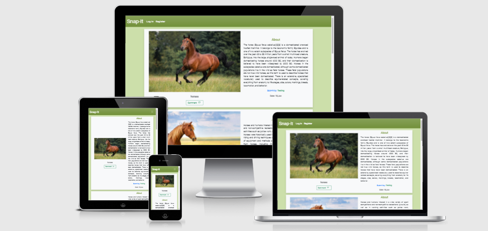

# Snap-It

Snap-it is a website for users to upload image url's and share the story relate to that.
Users can register and comment on post. 

Main purpose of this website is to:

- users are able to navigate through the site easily.
- let user post thier stories.
- Users can comment on post 
- Users can edit and delete thier post.
- Users can edit and delete thier comments

Note: This project is built for educational purpose. please dont share your personal or irrelevant Information.

## Table of Contents

* [User Experience Design](#User-Experience-Design)
    * [User Stories](#User-Stories)
    * [Color Scheme](#Color-Scheme)
    * [Typography](#Typography)
* [Website Structure](#Website-Structure)
    * [Wireframes](#Wireframes)
    * [Database Structure](#Database)
* [Features](#Features)
    * [Existing Features](#Existing-Features)
    * [Features to be Implemented](#Features-to-be-Implemented)
* [Technologies Used](#technologies)
    * [Languages](#Languages)
    * [Libraries and Frameworks](#Libraries-and-Frameworks)
    * [Tools](#Tools)
* [Testing](#Testing)
* [Deployment](#deployment)
    * [Project Creation](#Project-Creation)
    * [Heroku Deployment](#Heroku-Deployment)
    * [Local Deployment](#Local-Deployment)
* [Credits](#credits)
    * [Code](#Code)
    * [Acknowledgements](#Acknowledgements)

## User Experience Design

### User Stories

* User
    * As a User, I want that website layout is easy to understand and navigate through out all the pages.
    * As a User, I want to be able to register myself to the website.
    * As a User, I want to upload post from my profile.
    * As a User, I want to be able to Edit and Delete my post.
    * As a User, I want to be able to comment on post.
    * As a user, i want to be able to edit and delete my comments.
    * As a User, I want to be able to see other user post.
    * As a user, I want to be able to contact site owner.
    * As a user, i want to be able to see social media link relate to website.

* Returning user 
    * As a returning user, i would like to see if there is any comment on my post.
    * As a returning user, i i would like to see if there is any new post from other users.

* Site owner
    * As a site Owner, i want that website is responsive across all device from from desktop to mobile phones.
    * As a site owner, i want to control post and comment submit by all users.
    * As a site owner, i want that users are able signup and login without difficulty.
    * As a site owner, i want to be able to maintain the database.
    * As a site owner, i would like to know if any user come across any bug/issue with the website

## Color Scheme

* ### Color Scheme
    * I have used very basic color scheme for this project. As my purpose was to keep website simple and straight.
    * i have used the folowing colors in this project.
* Bootstrap Color scheme is used on some elements 
      

* Some other colors outside of bootstrap 

### Typography
   * for Typography i have used Roboto font family style which i have found on [Google Fonts](https://fonts.google.com).

## Website Structure

### WireFrames
   
   * [Home Page](wireframes/home_page.png)
   * [Register Page](wireframes/register_page.png)
   * [Log in Page](wireframes/Login_page.png)
   * [Community Page](wireframes/community_page.png)
   * [Comments Page](wireframes/comment_page.png)
   * [Upload/Edit Page](wireframes/comment_page.png)

### Database

* MongoDb
   * [Database Structure](wireframes/mongodb-structure.png). MongoDb is used to manage database for this site. I have made database structure by using [Lucid Chart](https://www.lucidchart.com)
      
   * [Site Map](wireframes/site-db-structure.png). I have used [Lucid Chart](https://www.lucidchart.com) to create this site map.

## Features

### Existing Features

   * Site Displays clean navigation as user enters. being responsive on all screens (Desktop to Mobile phone).
   * Users can Upload thier post easily through the forms input.
   * users can edit thier post if they want to update any field again.
   * users can delete thier post. a modal se linked to confirm deleting of post in case user clicked by no intention or change his choice.
   * user can view community post submited by other users.
   * user can comment if wants to, on any post.
   * user can delete his comment if want to.
   * Admin has full control on post and comments. 
   * footer is provided on every page. if user wants to contact site owner or access social media.

### Features to be Implemented
   * i would like add in future an option on community page that user can search post by title or date.
   * i would like to add option for password recovery in future.
   * i would like to implement comments enable/disable option to give to the user on his post.
   * i would like to give user choice to upload post in available categories or create one.
   * i would like to give user ability to upload images it self instead of URL option.

## Technologies

### Languages 
* [HTML](https://en.wikipedia.org/wiki/HTML) for front end.
* [CSS](https://en.wikipedia.org/wiki/CSS) for styling.
* [JavaScript](https://en.wikipedia.org/wiki/JavaScript) was used to create interactive elements on the website.
* [Python](https://www.python.org/) for the backend of the website.

### Libraries and Frameworks
* [Flask](https://flask.palletsprojects.com/en/2.0.x/) micro web framework is used in building this site.
* [Bootstrap](https://getbootstrap.com/) library is used for style and responsiveness.
* [JQuery](https://jquery.com/) is used to control the interactive button elements.
* [Google Fonts](https://fonts.google.com/) is used on this website.
* [Font Awesome](https://fontawesome.com/) is used for icons across the website.

### Tools
   * [Git](https://git-scm.com/) was used as the version control software to add, commit and push code to the GitHub repository.
   * [Gitpod](https://gitpod.io/) was used as the development environment to write my code.
   * [GitHub](https://github.com/) is the hosting site used to store the source code for the Website.
   * [MongoDB Atlas](https://www.mongodb.com/) was used for the database.
   * [PyMongo](https://pypi.org/project/pymongo/) provided tools for interacting with MongoDB from Python.
   * [Jinja](https://jinja.palletsprojects.com/en/3.0.x/) was used for templating.
   * [Heroku](https://heroku.com/) was used to run the application in the cloud.
   * [W3C Markup validator](https://validator.w3.org/) was used regularly to check for any errors in the HTML on the site.
   * [W3C CSS validator](https://jigsaw.w3.org/css-validator/) was used regularly to check for any errors in the CSS on the site.
   * [Web Accessibility](https://www.webaccessibility.com/) was used to test if website was accessible to people with disabilities.
   * [JSHint](https://jshint.com/) was used to test the JavaScript code for errors.
   * [PEP8 Online](http://pep8online.com/) was used to check for PEP8 compliance.

## Testing
   * The Testing Result can be found here. [testing.md](TESTING.md)

## Deployment

### Project Creation

This project was created on GitHub using the following steps:
* A new repository was created using the [CI full template tempates](https://github.com/Code-Institute-Org/gitpod-full-template)
* I gave my repository a meaningful name and clicked 'Create repository'
* Once the repository was created, I opened it on GitHub and clicked the 'Gitpod' button to build the workspace
* Version control was used throughout the project using the following commands:
    * git commit -m "descriptive updates" - This command was used to commit changes to the local repository
    * git push - This command was used to push all committed changes to the GitHub repository

### Heroku Deployment

**Setup Files**
   - Tell Heroku which applications and dependencies are required to run our app by setting up a requirements.txt and Procfile: 

> pip3 freeze --local > requirements.txt

> echo web: python app.py > Procfile

**Create Application**
1. Login to Heroku account
2. Click on the 'New' button
3. Select the 'Create new app' button
4. Create a unique app name
5. Choose relevant region

**Connect App to GitHub Repository**
1. Select GitHub from the 'Deployment Method'
2. Enter the repository name for the project and click search
3. When the repository has been found, click to connect to this app

**Set Environement Variables**
1. Click on settings tab for your app
2. Click on 'Reveal Config Vars'
3. Securely tell Heroku which variables are required using the key value pairs listed below:
> IP = 0.0.0.0
> PORT = 5000
> SECRET_KEY = YOUR_SECRET_KEY
> MONGO_URI = YOUR_MONGODB_URI
> MONGO_DBNAME = DATABASE_NAME

**Enable Automatic Deployment:**
1. Go back to the 'Deploy' tab
2. In the 'Automatic deploys' section, select to enable automatic deploys 

### Local Deployment

The following steps are required to run this locally: 

1. Go to the GitHub [repository](https://github.com/tashi-sk/flask-snap-it)
2. Click the 'Code' dropdown menu
3. Copy Git URL from HTTPS box (https://github.com/tashi-sk/flask-snap-it.git), or select to download the ZIP file
4. If usings the Git URL, open a new terminal in your IDE and type the 'git clone' command in the CLI and paste the copied URL
5. A clone of this project will be created locally on your machine
5. Alternatively, if you download the ZIP, unpackage locally and open in your IDE

[Back to top](#Table-of-Contents)

## Credits
   * Special Thanks to All mentors for making it easy to learn this project.
   * Thanks to slack community where i find all my answers to my queries.
   * Pagination functionality is taken from [GitHub User's Repository](https://gist.github.com/mozillazg/69fb40067ae6d80386e10e105e6803c9) and edited according to need.

## Acknowledgement

   * The images used on this website are taken from [Google](https://www.google.com) search including home page image.
   * All the text content of post uploaded is taken fron [Wikipedia](https:www.wikipedia.org).

